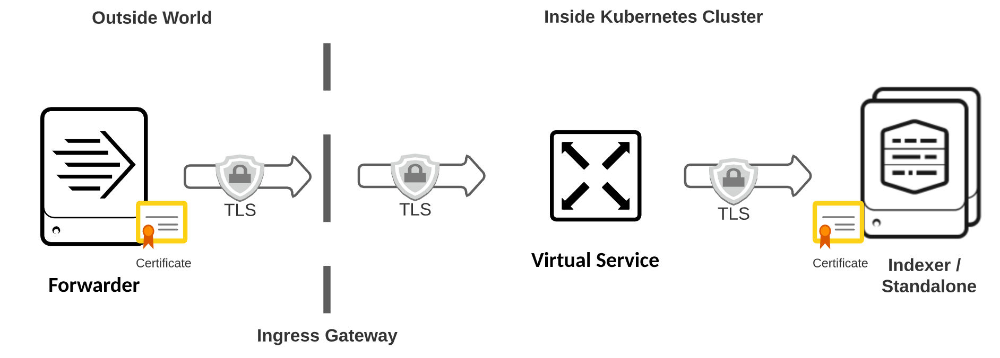
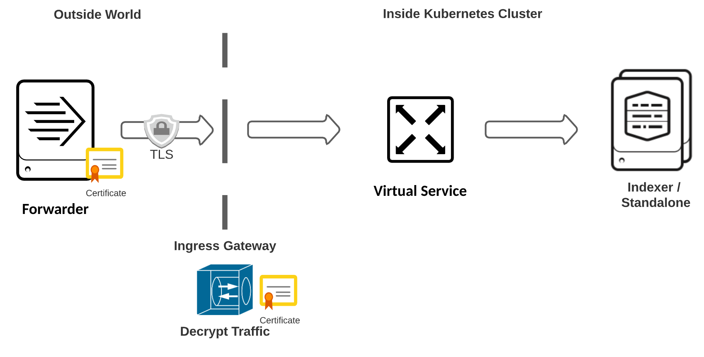

# 구성

## Ingress 구성

<https://splunk.github.io/splunk-operator/Ingress.html>

포트 전달을 사용하는 것은 테스트에 적합하지만 궁극적으로는 Kubernetes 외부에서 Splunk 클러스터에 더 쉽게 액세스할 수 있도록 만들고 싶을 것입니다. 일반적인 접근 방식은 Kubernetes 수신 컨트롤러를 사용하는 것입니다.

사용 가능한 Ingress 컨트롤러는 다양하며 각각 고유한 장단점이 있습니다. 각각을 구성하는 방법은 다양하며, 이는 특정 인프라 및 조직 정책에 따라 달라집니다.

Splunk Operator는 모든 관련 구성 요소에 대한 Kubernetes 서비스를 자동으로 생성하고 관리하며, 이를 통해 대부분의 Ingress 컨트롤러 및 구성과 쉽게 통합될 수 있을 것으로 기대합니다.

```bash
$ kubectl get services -o name
service/splunk-cluster-cluster-manager-service
service/splunk-cluster-deployer-service
service/splunk-cluster-indexer-headless
service/splunk-cluster-indexer-service
service/splunk-cluster-license-manager-service
service/splunk-cluster-search-head-headless
service/splunk-cluster-search-head-service
service/splunk-standalone-standalone-headless
service/splunk-standalone-standalone-service
```

아래에서는 가장 널리 사용되는 Ingress 컨트롤러 중 일부인 Istio, Nginx-inc 및 Ingress Nginx를 구성하는 몇 가지 예를 제공합니다. 이것이 귀하의 환경에서 수신을 구성하는 데 유용한 시작점이 되기를 바랍니다.

- Istio를 사용하여 수신 구성
- NGINX를 사용하여 수신 구성
- Let’s Encrypt를 사용하여 TLS 인증서 관리

예제를 배포하기 전에 yaml을 검토하고 "example.com"을 사용하려는 도메인 이름으로 바꾸고 서비스 이름의 "example"을 사용자 정의 리소스 개체의 이름으로 바꿔야 합니다. 또한 원하는 모든 호스트 이름에 대한 DNS가 수신 로드 밸런서의 IP 주소를 가리키도록 해야 합니다.

### Kubernetes에서 Splunk 사용에 대한 중요 참고 사항

#### 로드 밸런서 요구 사항

Splunk Forwarder와 함께 사용하기 위해 수신을 구성할 때 구성된 수신 로드 밸런서는 두 개 이상의 IP로 확인되어야 합니다. 이는 포워더의 자동 부하 분산 기능이 유지되기 위해 필요합니다.

#### Splunk 기본 네트워크 포트

Kubernetes에서 새 Splunk 인스턴스를 생성할 때 내부 로그, 복제 등과 같은 내부 통신에 기본 네트워크 포트가 사용됩니다. 이러한 포트가 구성되는 방식에 대한 모든 변경 사항은 클러스터 전체에서 일관되어야 합니다.

Ingress의 경우 암호화된 트래픽과 암호화되지 않은 트래픽에 별도의 포트를 사용하는 것이 좋습니다. 이 문서에서는 클러스터 외부에서 들어오는 암호화된 데이터에 포트 9998을 사용하고, 암호화되지 않은 클러스터 내 통신에는 기본 9997을 유지합니다. 예를 들어 이 ServiceTemplate 구성은 포트 9998이 노출된 독립 실행형 인스턴스를 생성합니다.

#### Indexer Discovery는 지원되지 않음

인덱서 검색은 Kubernetes 클러스터에서 지원되지 않습니다. 대신 Ingress 컨트롤러는 포워더를 인덱서 클러스터의 피어 노드에 연결하는 역할을 담당합니다.

## Istio를 사용하여 수신 구성

수신 컨트롤러인 Istio를 사용하면 클러스터가 외부 소스로부터 요청을 수신하고 이를 클러스터 내의 원하는 대상으로 라우팅할 수 있습니다. Istio는 호스트 이름, URI, HTTP 헤더와 같은 속성을 확인하여 데이터가 서비스로 라우팅되는 방식을 정밀하게 제어할 수 있는 Envoy 프록시를 활용합니다. 대상 규칙을 사용하면 서비스 자체 내에서도 데이터가 라우팅되는 방식을 세밀하게 제어할 수 있습니다.

특정 인프라에 맞게 Istio를 설치하고 구성하는 방법에 대한 지침은 Istio 시작 가이드를 참조하세요.

Istio에 대한 대부분의 시나리오에는 게이트웨이 및 가상 서비스 구성이 필요합니다. Istio Gateway 및 Istio Virtual Service에 대해 알아보세요.

### Splunk Web 및 HEC용 Ingress 구성

Splunk Web에 대한 직접 액세스를 제공하도록 Istio를 구성할 수 있습니다.

#### 독립형 구성

1. 포트 80에서 트래픽을 수신하기 위한 게이트웨이 만들기

    ```yaml
    apiVersion: networking.istio.io/v1beta1
    kind: Gateway
    metadata:
      name: splunk-web
    spec:
      selector:
        istio: ingressgateway # use istio default ingress gateway
      servers:
      - port:
          number: 80
          name: UI
          protocol: TCP
        hosts:
        - "splunk.example.com"
    ```

2. 서비스로 트래픽을 라우팅하는 가상 서비스를 만듭니다. 이 예에서는 독립 실행형을 사용합니다.

    ```yaml
    apiVersion: networking.istio.io/v1beta1
    kind: VirtualService
    metadata:
      name: splunk-web
    spec:
      hosts:
      - "splunk.example.com"
      gateways:
      - "splunk-web"
      tcp:
      - match:
        - port: 80
        route:
        - destination:
            port:
              number: 8000
            host: splunk-standalone-standalone-service
    ```

3. 다음 명령을 사용하여 Istio용 외부 IP를 가져옵니다.

    ```bash
    kubectl get svc -n istio-system
    ```

4. Splunk Web에 액세스하려면 브라우저를 사용하여 외부 IP에 연결하세요. 예를 들어:

    ```bash
    http://<LoadBalancer-External-IP>
    ```

#### 다중 호스트 및 HEC 구성

배포에 검색 헤드 및 클러스터 관리자와 같은 호스트가 여러 개 있는 경우 이 예를 사용하여 Splunk 웹 액세스 및 HTTP 이벤트 수집기 포트를 구성하십시오. HEC 토큰을 생성하는 방법과 HTTP를 사용하여 데이터를 보내는 방법을 알아보려면 HEC 문서에 있는 단계를 따르세요.

1. 여러 호스트에 대한 게이트웨이를 만듭니다.

    ```yaml
    apiVersion: networking.istio.io/v1beta1
    kind: Gateway
    metadata:
      name: splunk-web
    spec:
      selector:
        istio: ingressgateway # use istio default ingress gateway
      servers:
      - port:
          number: 80
          name: http
          protocol: HTTP
        hosts:
        - "splunk.example.com"
        - "deployer.splunk.example.com"
        - "cluster-manager.splunk.example.com"
        - "license-manager.splunk.example.com"
    ```

2. Kubernetes 외부에 노출하려는 각 구성 요소에 대해 VirtualService를 만듭니다.

```yaml
apiVersion: networking.istio.io/v1beta1
kind: VirtualService
metadata:
  name: splunk-web
spec:
  hosts:
  - "splunk.example.com"
  gateways:
  - "splunk-web"
  http:
  - match:
    - uri:
        prefix: "/services/collector"
    route:
    - destination:
        port:
          number: 8088
        host: splunk-example-indexer-service
  - route:
    - destination:
        port:
          number: 8000
        host: splunk-example-search-head-service
---
apiVersion: networking.istio.io/v1beta1
kind: VirtualService
metadata:
  name: splunk-deployer
spec:
  hosts:
  - "deployer.splunk.example.com"
  gateways:
  - "splunk-web"
  http:
  - route:
    - destination:
        port:
          number: 8000
        host: splunk-example-deployer-service
---
apiVersion: networking.istio.io/v1beta1
kind: VirtualService
metadata:
  name: splunk-cluster-manager
spec:
  hosts:
  - "cluster-manager.splunk.example.com"
  gateways:
  - "splunk-web"
  http:
  - route:
    - destination:
        port:
          number: 8000
        host: splunk-example-cluster-manager-service
---
apiVersion: networking.istio.io/v1beta1
kind: VirtualService
metadata:
  name: splunk-license-manager
spec:
  hosts:
  - "license-manager.splunk.example.com"
  gateways:
  - "splunk-web"
  http:
  - route:
    - destination:
        port:
          number: 8000
        host: splunk-example-license-manager-service
```

#### 사용자 세션이 특정 검색 헤드에 고정되도록 DestinationRule을 만듭니다

```bash
apiVersion: networking.istio.io/v1beta1
kind: DestinationRule
metadata:
  name: splunk-search-head-rule
spec:
  host: splunk-example-search-head-service
  trafficPolicy:
    loadBalancer:
      consistentHash:
        httpCookie:
          name: SPLUNK_ISTIO_SESSION
          ttl: 3600s
```

HTTP 이벤트 수집기를 사용하는 경우 ingress-gateway포트 8088에서 인바운드 TCP 연결을 수신하도록 서비스를 수정합니다.

```bash
kubectl patch -n istio-system service istio-ingressgateway --patch '{"spec":{"ports":[{"name":"splunk-hec","port":8088,"protocol":"TCP"}]}}'
```

## Splunk Forwarder 데이터에 대한 Ingress 구성

Splunk Forwarder에서 클러스터로의 인바운드 통신을 활성화하기 위한 전제 조건은 Istio 게이트웨이 및 Istio 가상 서비스를 구성하는 것입니다.

1. 게이트웨이를 생성합니다:

      ```yaml
      apiVersion: networking.istio.io/v1beta1
      kind: Gateway
      metadata:
        name: splunk-s2s
      spec:
        selector:
          istio: ingressgateway # use istio default ingress gateway
        servers:
        - port:
            number: 9997
            name: tcp-s2s
            protocol: TCP
          hosts:
          - "splunk.example.com"
      ```

2. 가상 서비스를 생성합니다:

    ```yaml
    apiVersion: networking.istio.io/v1beta1
    kind: VirtualService
    metadata:
      name: splunk-s2s
    spec:
      hosts:
      - "splunk.example.com"
      gateways:
      - "splunk-s2s"
      tcp:
      - match:
        - port: 9997
        route:
        - destination:
            port:
              number: 9997
            host: splunk-example-indexer-service
    ```

3. `ingress-gateway` 포트 9997에서 인바운드 TCP 연결을 수신하도록 서비스를 수정합니다 .

    ```bash
    kubectl patch -n istio-system service istio-ingressgateway --patch '{"spec":{"ports":[{"name":"splunk-s2s","port":9997,"protocol":"TCP"}]}}'
    ```

4. 전달자의 outputs.conf에서 Istio의 외부 IP를 사용합니다.

    ```bash
    kubectl get svc -n istio-system
    ```

### TLS를 사용하여 Splunk Forwarder 데이터에 대한 Ingress 구성

Splunk Enterprise 엔드포인트에는 항상 TLS 암호화를 사용하는 것이 좋습니다. 다음 섹션에서는 Istio에서 지원하는 두 가지 주요 구성을 다룹니다.

#### 엔드투엔드 TLS를 사용한 Splunk Forwarder 데이터

이 구성에서 Istio는 암호화된 트래픽을 종료 없이 Splunk Enterprise에 전달합니다. Forwarder와 Splunk Enterprise 인덱서, 클러스터 피어 또는 독립 실행형 인스턴스에서 TLS 인증서를 구성해야 합니다.



보안 통신을 위해 추가 포트를 추가합니다. 기본적으로 암호화되지 않은 트래픽에는 포트 9997이 할당되며 보안 통신을 위해 사용 가능한 다른 포트를 사용할 수 있습니다.

이 예에서는 독립형 인스턴스에 포트 9998을 추가하는 방법을 보여줍니다.

```yaml
apiVersion: enterprise.splunk.com/v4
kind: Standalone
metadata:
  name: standalone
  labels:
    app: SplunkStandAlone
    type: Splunk
  finalizers:
  - enterprise.splunk.com/delete-pvc
spec:
  serviceTemplate:
    spec:
      ports:
      - name: splunktest
        port: 9998
        protocol: TCP
        targetPort: 9998
```

1. 생성된 새 포트(9998)에서 S2S TCP 연결을 수신하도록 1ingress-gateway 서비스를 수정합니다.

    ```bash
    kubectl patch -n istio-system service istio-ingressgateway --patch '{"spec":{"ports":[{"name":"splunk-tls","port":9998,"protocol":"TCP"}]}}'
    ```

2. TLS 패스스루를 사용하여 게이트웨이를 생성합니다.

    ```yaml
    apiVersion: networking.istio.io/v1beta1
    kind: Gateway
    metadata:
      name: splunk-s2s
    spec:
      selector:
        istio: ingressgateway # use istio default ingress gateway
      servers:
      - port:
          number: 9998
          name: tls-s2s
          protocol: TLS
        tls:
          mode: PASSTHROUGH
        hosts:
        - "*"
    ```

3. TLS 라우팅을 위한 가상 서비스를 만듭니다.

    ```yaml
    apiVersion: networking.istio.io/v1beta1
    kind: VirtualService
    metadata:
      name: splunk-s2s
    spec:
      hosts:
      - "*"
      gateways:
      - "splunk-s2s"
      tls:
      - match:
        - port: 9998
          sniHosts:
          - "splunk.example.com"
        route:
        - destination:
            host: splunk-standalone-standalone-service
            port:
              number: 9998
    ```

참고: 이 TLS 예에서는 전달자의 outputs.conf에 tlsHostname = splunk.example.com 설정이 포함되어 있어야 합니다. Istio에서는 트래픽을 전달할 인덱서를 알 수 있도록 TLS 헤더를 정의해야 합니다. 이 매개변수가 정의되지 않으면 전달자 연결이 실패합니다.

모든 S2S 트래픽의 대상으로 사용하려는 인덱서 클러스터가 하나만 있는 경우 선택적으로 위 예의 splunk.example.com을 와일드카드 *로 바꿀 수 있습니다. 이 와일드카드를 사용하는 경우 전달자의 outputs.conf에 tlsHostname 매개 변수를 설정할 필요가 없습니다.

포트 9998을 열고 관련 TLS 설정을 구성하는 데 필요한 inputs.conf 설정을 사용하여 독립 실행형 인스턴스에 앱을 배포합니다. Splunk Operator를 사용한 앱 관리에 대한 자세한 내용은 Splunk 구성을 위한 앱 사용을 참조하세요.
문서 보안 전달 구성을 사용하여 Forwarder의 outputs.conf 및 Indexer의 inputs.conf를 구성합니다.

#### TLS 게이트웨이 종료를 사용한 Splunk Forwarder 데이터

이 구성에서 Istio는 게이트웨이에서 암호화를 종료하고 해독된 트래픽을 Splunk Enterprise로 전달합니다. 이 경우 Forwarder의 outputs.conf는 TLS용으로 구성되어야 하고, Indexer의 input.conf는 암호화되지 않은 트래픽을 허용하도록 구성되어야 합니다.



1. 트래픽을 해독하는 데 필요한 인증서로 TLS 비밀을 만듭니다. 다음은 TLS를 종료하기 위해 인덱서에서 사용되는 것과 동일한 명령입니다.

    ```bash
    kubectl create -n istio-system secret tls s2s-tls --key=<Path to private key> --cert=<Path to Indexer certificate>
    ```

2. TLS를 종료하는 게이트웨이를 만듭니다.

    ```yaml
    apiVersion: networking.istio.io/v1beta1
    kind: Gateway
    metadata:
      name: splunk-s2s
    spec:
      selector:
        istio: ingressgateway # use istio default ingress gateway
      servers:
      - port:
          number: 9997
          name: tls-s2s
          protocol: TLS
        tls:
          mode: SIMPLE
          credentialName: s2s-tls # must be the same as secret
        hosts:
        - "*"
    ```

3. TCP 라우팅을 위한 가상 서비스를 생성합니다.

    ```yaml
    apiVersion: networking.istio.io/v1beta1
    kind: VirtualService
    metadata:
      name: splunk-s2s
    spec:
      hosts:
      - "*"
      gateways:
      - splunk-s2s
      tcp:
      - match:
        - port: 9997
        route:
        - destination:
            port:
              number: 9997
            host: splunk-standalone-standalone-service
    ```

    가상 서비스는 게이트웨이에서 종료되었으므로 더 이상 TLS를 처리하지 않습니다.

4. 설명서를 사용하여 포워더 및 인덱서 또는 독립 실행형 인증서를 구성합니다: 포워더로부터 데이터 보호.
    Istio v1.8 및 Kubernetes v1.17에서 테스트된 문서

## Service Mesh 및 Istio에 대한 참고 사항

Istio는 Service Mesh 기능으로 인해 인기 있는 선택입니다. 그러나 Splunk용 Service Mesh 인스턴스는 Kubernetes v1.19 이상과 함께 Istio v1.8 이상에서만 지원됩니다. 이 문서가 작성되는 시점에는 Amazon AWS나 Google Cloud 모두 스택을 이러한 버전으로 업데이트하지 않았습니다.

## NGINX를 사용하여 수신 구성

참고 : Nginx Ingress 컨트롤러에는 최소한 3가지 버전이 있습니다.

- Kubernetes Ingress Nginx(오픈소스)
- Nginx Ingress 오픈 소스(F5의 오픈 소스 버전)
- Nginx Ingress Plus(F5의 유료 버전)

Nginx 비교 차트 .

주석과 구성이 매우 다르기 때문에 구현하려는 Nginx Ingress 컨트롤러를 확인하는 것이 중요합니다 . 이러한 예에서는 Kubernetes Ingress Nginx(옵션 1) 및 Nginx Ingress Open Source(옵션 2)를 사용합니다.

### Kubernetes Ingress Nginx를 사용하여 수신 구성

NGINX 수신 컨트롤러를 설치하고 구성하는 방법에 대한 지침은 NGINX 수신 컨트롤러 GitHub 리포지토리 및 설치 가이드 를 참조하세요 .

이 수신 컨트롤러는 ConfigMap을 사용하여 클러스터에 대한 수신 액세스를 활성화합니다. 현재 TCP 게이트웨이 종료는 지원되지 않습니다. 이 기능에 대한 요청은 요청 3087 및 티켓 636 에서 가능 하지만 현재 게이트웨이 종료에는 HTTPS만 지원됩니다.

TCP를 통한 Splunk Forwarder 통신의 경우 사용 가능한 유일한 구성은 종단 간 TLS 종료입니다. 인증서 생성 및 관리에 대한 세부 사항과 Forwarder 및 Indexer의 구성은 위의 Istio End-to-End TLS 예시와 동일합니다.

아래의 모든 구성에 대해 AWS용 설치 안내서에 템플릿으로 제공되는 표준 yaml인 Ingress NGINX AWS 샘플 배포 로 시작했습니다 . 그런 다음 각 시나리오에 따라 해당 구성 요소를 추가하거나 업데이트합니다.

#### Splunk Web용 Ingress 구성

Splunk Web에 대한 직접 액세스를 제공하도록 Nginx를 구성할 수 있습니다.

독립형에 대한 Ingress 구성을 생성하는 예:

```yaml
apiVersion: networking.k8s.io/v1beta1
kind: Ingress
metadata:
  name: ingress-standalone
  annotations:
    # use the shared ingress-nginx
    kubernetes.io/ingress.class: "nginx"
    nginx.ingress.kubernetes.io/default-backend: splunk-standalone-standalone-service
    nginx.ingress.kubernetes.io/proxy-body-size: "0"
    nginx.ingress.kubernetes.io/proxy-read-timeout: "600"
    nginx.ingress.kubernetes.io/proxy-send-timeout: "600"
spec:
  rules:
  - host: splunk.example.com
    http:
      paths:
      - path: /
        backend:
          serviceName: splunk-standalone-standalone-service
          servicePort: 8000
```

여러 호스트에 대한 수신 구성을 만드는 예:

```yaml
apiVersion: networking.k8s.io/v1beta1
kind: Ingress
metadata:
  name: ingress-standalone
  annotations:
    # use the shared ingress-nginx
    kubernetes.io/ingress.class: "nginx"
    nginx.ingress.kubernetes.io/default-backend: splunk-standalone-standalone-service
    nginx.ingress.kubernetes.io/proxy-body-size: "0"
    nginx.ingress.kubernetes.io/proxy-read-timeout: "600"
    nginx.ingress.kubernetes.io/proxy-send-timeout: "600"
spec:
  rules:
  - host: splunk.example.com
    http:
      paths:
      - path: /
        backend:
          serviceName: splunk-example-search-head-service
          servicePort: 8000
      - path: /services/collector
        backend:
          serviceName: splunk-example-indexer-service
          servicePort: 8088
  - host: deployer.splunk.example.com
    http:
      paths:
      - backend:
          serviceName: splunk-example-deployer-service
          servicePort: 8000
  - host: cluster-manager.splunk.example.com
    http:
      paths:
      - backend:
          serviceName: splunk-example-cluster-manager-service
          servicePort: 8000
```

TLS 지원 Ingress 구성을 생성하는 예

TLS 구성에는 알아야 할 몇 가지 중요한 구성이 있습니다.

백엔드 서비스에 TLS가 구성되어 있는 경우 주석 nginx.ingress.kubernetes.io/backend-protocol:이 필요합니다 ."HTTPS"
secretName은 유효한 TLS 비밀을 참조해야 합니다 .
참고: 이 예에서는 Splunk Web에 대해 https가 활성화되어 있다고 가정합니다.

```yaml
apiVersion: networking.k8s.io/v1beta1
kind: Ingress
metadata:
  annotations:
    kubernetes.io/ingress.class: "nginx"
    nginx.ingress.kubernetes.io/affinity: "cookie"
    nginx.ingress.kubernetes.io/affinity-mode: "persistent"
    nginx.ingress.kubernetes.io/session-cookie-name: "route"
    nginx.ingress.kubernetes.io/session-cookie-expires: "172800"
    nginx.ingress.kubernetes.io/session-cookie-max-age: "172800"
    nginx.ingress.kubernetes.io/client-body-buffer-size: 100M
    nginx.ingress.kubernetes.io/backend-protocol: "HTTPS"
    nginx.ingress.kubernetes.io/session-cookie-samesite: "true"
    nginx.ingress.kubernetes.io/session-cookie-path: "/en-US"
    cert-manager.io/cluster-issuer: selfsigned
  name: splunk-ingress
  namespace: default
spec:
  rules:
  - host: shc.example.com
    http:
      paths:
      - path: /en-US
        pathType: Prefix
        backend:
          serviceName: splunk-shc-search-head-service
          servicePort: 8000
  - host: hec.example.com
    http:
      paths:
      - path: /services/collector
        pathType: Prefix
        backend:
          serviceName: splunk-idc-indexer-service
          servicePort: 8088
  tls:
  - hosts:
    - shc.example.com
    - hec.example.com
    secretName: operator-tls
```

엔드투엔드 TLS를 사용하여 Splunk 포워더용 Ingress NGINX 구성
참고: 이 예에서는 암호화되지 않은 통신에 포트 9997을 사용하고 암호화된 통신에 9998을 사용했습니다.

기본 Ingress NGINX 구성을 업데이트하여 ConfigMap 및 서비스 포트를 추가합니다.

포트-서비스 라우팅을 정의하기 위한 configMap 생성

```yaml
apiVersion: v1
kind: ConfigMap
metadata:
  name: tcp-services
  namespace: ingress-nginx
data:
  9997: "default/splunk-standalone-standalone-service:9997"
  9998: "default/splunk-standalone-standalone-service:9998"
```

로드 밸런서를 구성하는 데 사용되는 서비스에 두 개의 포트를 추가합니다.

```yaml
apiVersion: v1
kind: Service
metadata:
  annotations:
    service.beta.kubernetes.io/aws-load-balancer-backend-protocol: tcp
    service.beta.kubernetes.io/aws-load-balancer-cross-zone-load-balancing-enabled: 'true'
    service.beta.kubernetes.io/aws-load-balancer-type: nlb
  labels:
    helm.sh/chart: ingress-nginx-3.10.1
    app.kubernetes.io/name: ingress-nginx
    app.kubernetes.io/instance: ingress-nginx
    app.kubernetes.io/version: 0.41.2
    app.kubernetes.io/managed-by: Helm
    app.kubernetes.io/component: controller
  name: ingress-nginx-controller
  namespace: ingress-nginx
spec:
  type: LoadBalancer
  externalTrafficPolicy: Local
  ports:
    - name: http
      port: 80
      protocol: TCP
      targetPort: http
    - name: https
      port: 443
      protocol: TCP
      targetPort: https
    - name: tcp-s2s
      port: 9997
      protocol: TCP
      targetPort: 9997
    - name: tls-s2s
      port: 9998
      protocol: TCP
      targetPort: 9998
```

Ingress Nginx v1.19.4 및 Kubernetes v1.17에서 테스트된 문서

## NGINX 수신 컨트롤러(Nginxinc)를 사용하여 수신 구성

Nginx Ingress Controller는 F5 제품의 오픈 소스 버전입니다. 자세한 내용은 아래 문서를 검토하세요.

[NGINX 수신 컨트롤러 Github Repo](https://github.com/nginxinc/kubernetes-ingress)
[NGINX 수신 컨트롤러 문서 홈](https://docs.nginx.com/nginx-ingress-controller/overview/)
[NGINX 수신 컨트롤러 주석 페이지](https://docs.nginx.com/nginx-ingress-controller/configuration/ingress-resources/advanced-configuration-with-annotations/)

### Nginx Helm 차트 설치

우리는 제품의 Helm Chart 설치 가이드를 따랐습니다. 인터넷에 액세스할 수 있는 클러스터가 필요합니다. NGINX 수신 컨트롤러 헬름 설치

#### Helm 설정

```bash
# clone the repo and check out the current production branch
$ git clone https://github.com/nginxinc/kubernetes-ingress/
$ cd kubernetes-ingress/deployments/helm-chart
$ git checkout v1.9.0

# add the helm chart
$ helm repo add nginx-stable https://helm.nginx.com/stable
$ helm repo update

# install custom resource definitions
$ kubectl create -f crds/
```

#### Ingress 설치

```bash
cd deployments/helm-chart

# Edit and make changes to values.yaml as needed
helm install splunk-nginx nginx-stable/nginx-ingress

#list the helms installed
helm list

NAME            NAMESPACE   REVISION    UPDATED             STATUS      CHART               APP VERSION
splunk-nginx  default     5  2020-10-29 15:03:47.6 EDT    deployed    nginx-ingress-0.7.0 1.9.0

#if needed to update any configs for ingress, update the values.yaml and run upgrade
helm upgrade splunk-nginx  nginx-stable/nginx-ingress
```

#### Ingress 서비스 구성

##### Splunk Web 및 HEC용 Ingress 구성방안

다음 수신 예제 yaml은 Splunk Web과 HEC를 운영자 설치 서비스로 구성합니다. HEC는 SSL을 통해 노출되고 Splunk Web은 SSL이 아닙니다.

- 수신 컨트롤러에 대한 TLS는 tls:yaml 섹션 에서 구성되며 secretName유효한 TLS 비밀을 참조합니다 .
- TLS가 활성화된 백엔드 서비스의 경우 해당 서비스 nginx.org/ssl-services annotation가 필요합니다.

##### Ingress 생성

```yaml
apiVersion: extensions/v1beta1
kind: Ingress
metadata:
  annotations:
    certmanager.k8s.io/cluster-issuer: letsencrypt-prod
    nginx.org/client-body-buffer-size: 100M
    nginx.org/client-max-body-size: "0"
    nginx.org/server-snippets: |
      client_body_buffer_size 100m;
    nginx.org/ssl-services: splunk-standalone-standalone-headless
  name: splunk-ingress
  namespace: default
spec:
  ingressClassName: nginx
  rules:
  - host: splunk.example.com
    http:
      paths:
      - backend:
          serviceName: splunk-standalone-standalone-service
          servicePort: 8000
        path: /en-US
        pathType: Prefix
      - backend:
          serviceName: splunk-standalone-standalone-headless
          servicePort: 8088
        path: /services/collector
        pathType: Prefix
      - backend:
          serviceName: splunk-standalone-standalone-headless
          servicePort: 8089
        path: /.well-known
        pathType: Prefix
  tls:
  - hosts:
    - splunk.example.com
    secretName: operator-tls
status:
  loadBalancer: {}
```

#### Splunk Forwarder를 위한 수신 서비스

수신기 및 전송 서버를 설정하려면 전역 구성을 활성화하세요.

1. 글로벌 구성을 생성합니다:

    ```yaml
    apiVersion: k8s.nginx.org/v1alpha1
    kind: GlobalConfiguration
    metadata:
      name: nginx-configuration
      namespace: default
    spec:
      listeners:
      - name: s2s-tcp
        port: 30403
        protocol: TCP
    apiVersion: k8s.nginx.org/v1alpha1
    kind: TransportServer
    metadata:
      name: s2s-tcp
    spec:
      listener:
        name: s2s-tcp
        protocol: TCP
      upstreams:
      - name: s2s-app
        service: splunk-standalone-standalone-service
        port: 9997
          action:
        pass: s2s-app
    ```

2. 서비스를 편집하여 리스너로 설정되는 포트에 대한 노드 포트를 설정하십시오.
    - 서비스를 나열하십시오.

    ```bash
    kubectl get svc
    NAME                                         TYPE           CLUSTER-IP       EXTERNAL-IP                                                               PORT(S)                                                            AGE
    splunk-nginx-nginx-ingress                 LoadBalancer   172.20.195.54    aa725344587a4443b97c614c6c78419c-1675645062.us-east-2.elb.amazonaws.com   80:31452/TCP,443:30402/TCP,30403:30403/TCP                         7d1h
    ```

3. 서비스를 편집하고 Splunk Forwarder 수신 포트를 추가합니다.

    ```bash
    kubectl edit service splunk-nginx-nginx-ingress
    ```

    서비스 예시:

    ```yaml
    apiVersion: v1
    kind: Service
    metadata:
      annotations:
        meta.helm.sh/release-name: splunk-nginx
        meta.helm.sh/release-namespace: default
      creationTimestamp: "2020-10-23T17:05:08Z"
      finalizers:
      - service.kubernetes.io/load-balancer-cleanup
      labels:
        app.kubernetes.io/instance: splunk-nginx
        app.kubernetes.io/managed-by: Helm
        app.kubernetes.io/name: splunk-nginx-nginx-ingress
        helm.sh/chart: nginx-ingress-0.7.0
      name: splunk-nginx-nginx-ingress
      namespace: default
      resourceVersion: "3295579"
      selfLink: /api/v1/namespaces/default/services/splunk-nginx-nginx-ingress
      uid: a7253445-87a4-443b-97c6-14c6c78419c9
    spec:
      clusterIP: 172.20.195.54
      externalTrafficPolicy: Local
      healthCheckNodePort: 32739
      ports:
      - name: http
        nodePort: 31452
        port: 80
        protocol: TCP
        targetPort: 80
      - name: https
        nodePort: 30402
        port: 443
        protocol: TCP
        targetPort: 443
      - name: s2s
        nodePort: 30403
        port: 30403
        protocol: TCP
        targetPort: 30403
      selector:
        app: splunk-nginx-nginx-ingress
      sessionAffinity: None
      type: LoadBalancer
    ```

Nginx Ingress Controller v1.9.0 및 Kubernetes v1.18에서 테스트된 문서

## Let's Encrypt를 사용하여 TLS 인증서 관리

Let's Encrypt 와 함께 cert-manager를 사용하여 Kubernetes에서 TLS 인증서를 관리하는 경우 이 예제 Ingress 객체를 사용하여 Kubernetes 클러스터 외부에서 모든 Splunk 구성 요소에 대한 보안(TLS) 액세스를 활성화할 수 있습니다.

### NGINX 구성 예시

```yaml
apiVersion: extensions/v1beta1
kind: Ingress
metadata:
  name: splunk-ingress
  annotations:
    kubernetes.io/ingress.class: nginx
    nginx.ingress.kubernetes.io/affinity: cookie
    certmanager.k8s.io/cluster-issuer: "letsencrypt-prod"
spec:
  rules:
  - host: splunk.example.com
    http:
      paths:
      - path: /
        backend:
          serviceName: splunk-example-search-head-service
          servicePort: 8000
      - path: /services/collector
        backend:
          serviceName: splunk-example-indexer-service
          servicePort: 8088
  - host: deployer.splunk.example.com
    http:
      paths:
      - backend:
          serviceName: splunk-example-deployer-service
          servicePort: 8000
  - host: cluster-manager.splunk.example.com
    http:
      paths:
      - backend:
          serviceName: splunk-example-cluster-manager-service
          servicePort: 8000
  - host: license-manager.splunk.example.com
    http:
      paths:
      - backend:
          serviceName: splunk-example-license-manager-service
          servicePort: 8000
  tls:
  - hosts:
    - splunk.example.com
    - deployer.splunk.example.com
    - cluster-manager.splunk.example.com
    - license-manager.splunk.example.com
    secretName: splunk.example.com-tls
```

주석은 certmanager.k8s.io/cluster-issuer선택 사항이며 인증서를 자동으로 생성하고 관리하는 데 사용됩니다. 발행자와 일치하도록 변경할 수 있습니다.

cert-manager를 사용하지 않는 경우 이 주석을 제거하고 섹션을 tls적절하게 업데이트해야 합니다. tls인증서를 각 호스트 이름에 대한 별도의 보안 비밀로 수동으로 가져오는 경우 Ingress에서 여러 개체를 사용하여 이를 참조할 수 있습니다 .

```yaml
tls:
  - hosts:
    - splunk.example.com
    secretName: splunk.example.com-tls
  - hosts:
    - deployer.splunk.example.com
    secretName: deployer.splunk.example.com-tls
  - hosts:
    - cluster-manager.splunk.example.com
    secretName: cluster-manager.splunk.example.com-tls
…
```

### Istio 구성 예시

Let's Encrypt 와 함께 cert-manager를 사용하여 Kubernetes에서 TLS 인증서를 관리하는 경우:

1. 인증서 객체를 생성하고 네임스페이스 splunk-example-com-tls에 비밀을 채웁니다 istio-system. 예를 들어:

    ```yaml
    apiVersion: certmanager.k8s.io/v1alpha1
    kind: Certificate
    metadata:
      name: splunk-example-com-cert
      namespace: istio-system
    spec:
      secretName: splunk-example-com-tls
      commonName: splunk.example.com
      dnsNames:
        - splunk.example.com
        - deployer.splunk.example.com
        - cluster-manager.splunk.example.com
        - license-manager.splunk.example.com
      issuerRef:
        name: letsencrypt-prod
        kind: ClusterIssuer
    ```

2. 인증서와 연결된 Istio 게이트웨이를 만듭니다.

    ```yaml
    apiVersion: networking.istio.io/v1beta1
    kind: Gateway
    metadata:
      name: splunk-gw
    spec:
      selector:
        istio: ingressgateway # use istio default ingress gateway
      servers:
      - port:
          number: 80
          name: http
          protocol: HTTP
        hosts:
        - "splunk.example.com"
        - "deployer.splunk.example.com"
        - "cluster-manager.splunk.example.com"
        - "license-manager.splunk.example.com"
        tls:
          httpsRedirect: true
      - port:
          number: 443
          name: https
          protocol: HTTPS
        tls:
          mode: SIMPLE
          credentialName: "splunk-example-com-tls"
        hosts:
        - "splunk.example.com"
        - "deployer.splunk.example.com"
        - "cluster-manager.splunk.example.com"
        - "license-manager.splunk.example.com"
    ```

    credentialName은 인증서 개체가 만들고 관리하는 것과 동일한 secretName을 참조합니다.

3. 인증서를 각 호스트 이름에 대한 별도의 보안 비밀로 수동으로 가져오는 경우 게이트웨이에서 여러 포트 객체를 대신 사용하여 이를 참조할 수 있습니다.

    ```yaml
    - port:
        number: 443
        name: https
        protocol: HTTPS
      tls:
        mode: SIMPLE
        credentialName: "splunk-example-com-tls"
      hosts:
      - "splunk.example.com"
    - port:
        number: 443
        name: https
        protocol: HTTPS
      tls:
        mode: SIMPLE
        credentialName: "deployer-splunk-example-com-tls"
      hosts:
      - "deployer.splunk.example.com"
    ...
    ```

4. Kubernetes 외부에 노출하려는 각 구성 요소에 대해 VirtualServices를 만듭니다.

    ```yaml
    apiVersion: networking.istio.io/v1beta1
    kind: VirtualService
    metadata:
      name: splunk
    spec:
      hosts:
      - "splunk.example.com"
      gateways:
      - "splunk-gw"
      http:
      - match:
        - uri:
            prefix: "/services/collector"
        route:
        - destination:
            port:
              number: 8088
            host: splunk-example-indexer-service
      - route:
        - destination:
            port:
              number: 8000
            host: splunk-example-search-head-service
    ---
    apiVersion: networking.istio.io/v1beta1
    kind: VirtualService
    metadata:
      name: splunk-deployer
    spec:
      hosts:
      - "deployer.splunk.example.com"
      gateways:
      - "splunk-gw"
      http:
      - route:
        - destination:
            port:
              number: 8000
            host: splunk-example-deployer-service
    ---
    apiVersion: networking.istio.io/v1beta1
    kind: VirtualService
    metadata:
      name: splunk-cluster-manager
    spec:
      hosts:
      - "cluster-manager.splunk.example.com"
      gateways:
      - "splunk-gw"
      http:
      - route:
        - destination:
            port:
              number: 8000
            host: splunk-example-cluster-manager-service
    ---
    apiVersion: networking.istio.io/v1beta1
    kind: VirtualService
    metadata:
      name: splunk-license-manager
    spec:
      hosts:
      - "license-manager.splunk.example.com"
      gateways:
      - "splunk-gw"
      http:
      - route:
        - destination:
            port:
              number: 8000
            host: splunk-example-license-manager-service
    ```

5. 사용자 세션이 특정 검색 헤드에 고정되도록 DestinationRule을 만듭니다.

    ```yaml
    apiVersion: networking.istio.io/v1beta1
    kind: DestinationRule
    metadata:
      name: splunk-search-head-rule
    spec:
      host: splunk-example-search-head-service
      trafficPolicy:
        loadBalancer:
          consistentHash:
            httpCookie:
              name: SPLUNK_ISTIO_SESSION
              ttl: 3600s
    ```
